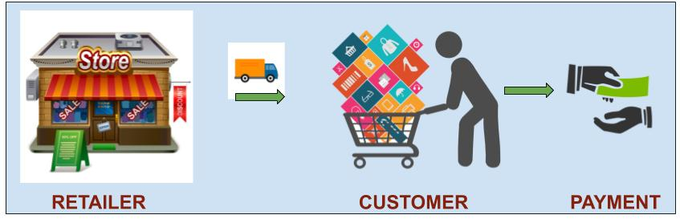
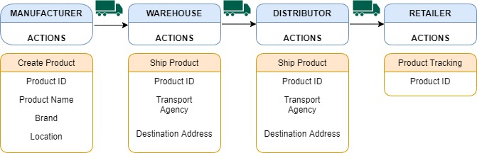
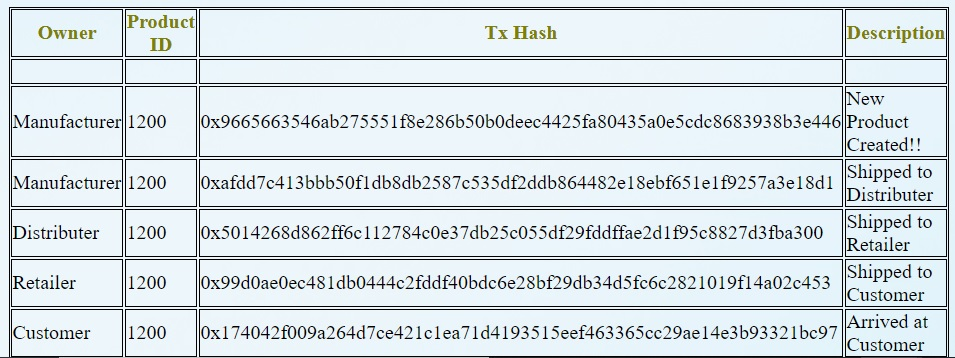
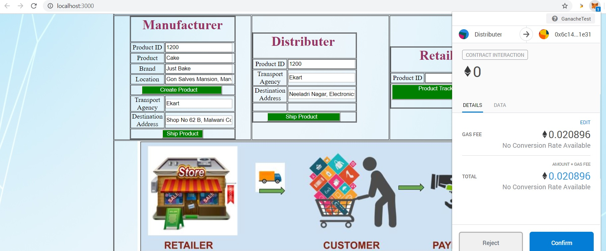
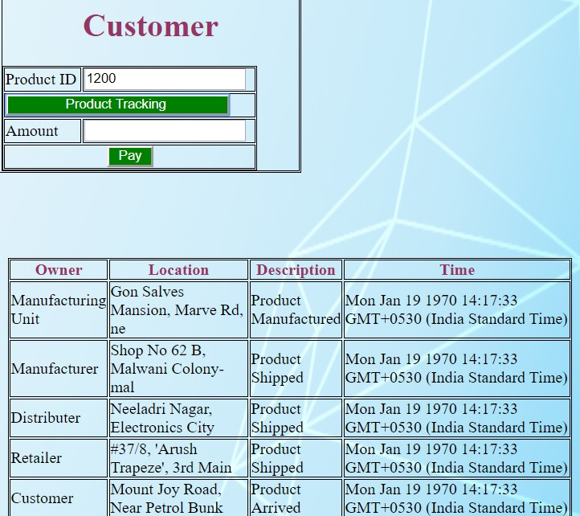
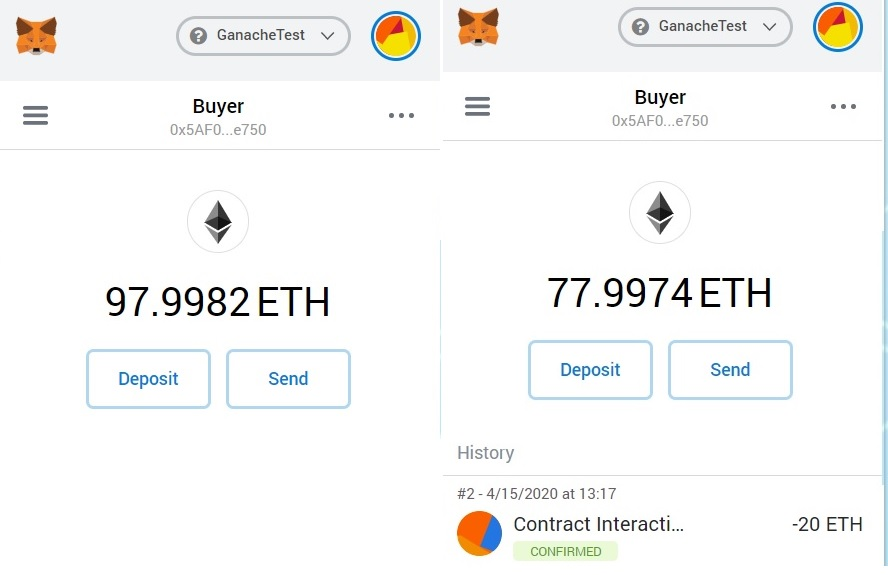
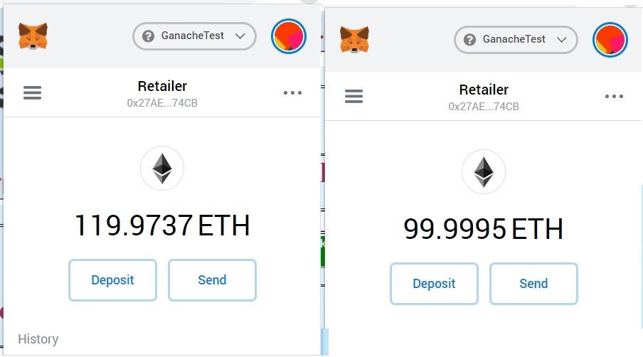
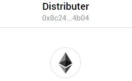
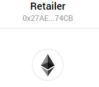
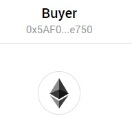

# Retail Supplychain using Ethereum Smart Contract

This project showcases the tracking history , selling and purchasing of the product on blockchain using html + Truffle + Ethereum

#### Problems in Existing System
---

- Currently tracking, selling, purchasing of product in traditional systems can not be trusted.

- Blockchain can solve this by providing immutable and verifiable data sources

#### What we are providing?
---

- We have implemented smart contract storing the product details shipping to various participants also can be tracked by the customer

#### Workflow Diagram one
---


Here, the Manufacturer creates a new product and ships to the distributer.
The distributer ships to retailer. The retailer can also view the history of tracking details of specific product.

#### Workflow Diagram two
---

Once the customer places an order, the retailer ships the product to customer at a specific price.
The customer can also view the history of tracking details of the specific product.
Customer later pays the amount to the retailer once it receives the product.
The transport agent updates the details of the destination customer address.

#### Included Components
---
-  Solidity (Ethereum)
-  Metamask  (Ethereum wallet)
-  Truffle (npm install -g truffle or on linux sudo npm install -g truffle)
-  Web3JS
-  Ganache

#### Prerequisites
---
- Nodejs v9.10 or above
- Truffle v4.1.8 (core: 4.1.8) (http://truffleframework.com/docs/getting_started/installation)
- Solidity v0.5.0
- Metamask (https://metamask.io) /Ganache Wallet
- Ganache App
- npm install

#### Deployment Steps:
---
**Setting up Ethereum Smart Contract:**

```
git clone https://github.com/anithakc6/RetailSupplyChainEthereum.git
cd RetailSupplyChainEthereum/
```
Go to your project folder in terminal then execute :

```
truffle compile
truffle migrate (if second time, truffle migrate --reset)
npm run dev
Connect Metamask to Ganache URL http://localhost:7545
```
#### Application Workflow Diagram One
---


#### In this application we have three stages
---

1. Manufacturer
2. Distributor
3. Retailer

**Manufacturer :** Manufacturer creates a new product.

**Warehouse :** Manufacturing warehouse ships the product to the distributer.

**Distributor :** Distributor ships the product to the retailer.

**Retailer :** Retailer can verify the history of product tracking.

#### Application Workflow Diagram Two
---


#### In this application we have two stages
---

1. Retailer
2. Customer

**Retailer :** Retailer sells the product to the customer.

**Customer :** Once received pays the amount to the retailer. Also can view the tracking history.

**Transport Agent :** The transport agent updates the destination address , once the product is reached to the customer.

#### Development Screen's
---

#### Create Product
---


- Create Product -> Update all the details of the new product. Ensure in metamask you assign 0xcB41A243C998fB78e888478BE478EC2172FCa7a4 as manufacturer and click on the button.


#### Product Transactions Lists
---


- Table of entries of all the transactions of creating, shipping, selling of the product is displayed here.
- Metamask account - Checkout for the metamask account details below.

#### Distributor Ship Product(Similar transactions for Manufacturer/Retailer)
---


- Ship Product - Update all the details.Ensure in metamask you assign 0x8c24E5ef7f6Edf9858B7e4A7D886BB94110d4b04 as distributor and click on the button.
- Metamask account - Checkout for the metamask account details below.

#### Product Tracking
---


- Product Tracking - Update the product id to view the history of tracking details

#### Buyer Wallet (Payment of 20 ethers)
---


- Pay - Once the customer pays the amount to the retailer, verify the deduction in the Metamask wallet of the Buyer

#### Retailer Wallet (Received amount)
---


- Retailer Wallet - Verify the amount added in the Metamask wallet

#### Metamask Account Details
---
In this project, various different account addresses are used for participants,
Rename these accounts in metamask for doing transactions.

1) Seller -> 0xcB41A243C998fB78e888478BE478EC2172FCa7a4
---


2) Distributer -> 0x8c24E5ef7f6Edf9858B7e4A7D886BB94110d4b04
---


3) Retailer -> 0x27AE28a5ff997e406C1a7754ee6cD6451bb574CB
---


4) Buyer -> 0x5AF02fdd6cEE461529B31Dde71A43c3e3c9ce750
---



